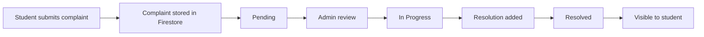
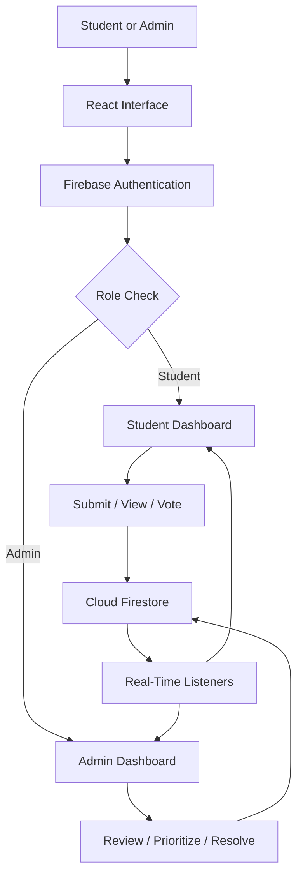

<div align="center">

# HostelMitra

### A real-time hostel complaint management portal for students and administrators

<p>
  <a href="https://hostelmitra-81b7d.web.app/">
    
  </a>
  <a href="https://github.com/Kumaryan12/HostelMitra">
    
  </a>
</p>

<p>
  
  
  
  
  
  
</p>

**Submit · Track · Prioritize · Resolve**

</div>

---

## Overview

**HostelMitra** is a full-stack hostel complaint management portal designed to make campus complaint handling more structured, transparent, and accountable.

Instead of relying on scattered WhatsApp messages, informal follow-ups, or manual complaint registers, HostelMitra creates a centralized workflow where students can submit and track issues while administrators can review, prioritize, update, and resolve them.

> Designed for NIT Goa hostel complaint workflows and deployed as a live campus complaint-management prototype.

<table>
<tr>
<td width="50%" valign="top">

### For Students

- Sign in using Google Authentication
- Submit hostel-related complaints
- Add title, description, and category
- Track complaint status in real time
- View active and resolved complaints
- Vote for issues affecting multiple students

</td>
<td width="50%" valign="top">

### For Administrators

- View complaints from one dashboard
- Filter and prioritize reported issues
- Update complaint status
- Add resolution notes
- Track timestamps and complaint history
- Identify recurring operational problems

</td>
</tr>
</table>

---

## The Problem

Hostel complaint handling is often fragmented:

- complaints are shared through informal channels
- students cannot reliably track progress
- repeated issues are difficult to identify
- admins lack a clear priority order
- status updates are not visible to students
- resolution history and audit trails are missing

HostelMitra replaces this fragmented process with a simple digital lifecycle.

```text
Report → Review → Prioritize → Resolve → Verify
```

---

## Core Features

| Area | Features |
|---|---|
| **Authentication** | Google OAuth through Firebase Authentication |
| **Complaint submission** | Title, description, category, status, and user metadata |
| **Real-time tracking** | Firestore listeners update complaint state instantly |
| **Role-based access** | Separate student and administrator workflows |
| **Prioritization** | Vote-based visibility for commonly reported issues |
| **Administration** | Status changes, resolution notes, and complaint closure |
| **Auditability** | Created and updated timestamps with resolution history |
| **Interface** | Responsive design for desktop and mobile use |

---

## Complaint Lifecycle



### Status flow

```text
Submitted → Pending → In Progress → Resolved
```

---

## System Architecture



### Main Components

<table>
<tr>
<td width="50%" valign="top">

#### Authentication Layer

- Handles Google sign-in
- Identifies the authenticated user
- Supports student and admin roles
- Can be extended with college-domain restrictions

#### Student Complaint Layer

- Creates new complaints
- Stores category, description, status, and timestamps
- Supports complaint visibility and voting

</td>
<td width="50%" valign="top">

#### Admin Management Layer

- Displays submitted complaints
- Updates status and resolution notes
- Helps prioritize common or urgent issues
- Tracks unresolved and recurring problems

#### Data Layer

- Stores complaints and users in Firestore
- Provides real-time updates
- Supports responsive dashboard behaviour

</td>
</tr>
</table>

---

## Technology Stack

<table>
<tr>
<td><strong>Frontend</strong></td>
<td>React, responsive web interface</td>
</tr>
<tr>
<td><strong>Authentication</strong></td>
<td>Firebase Authentication, Google OAuth</td>
</tr>
<tr>
<td><strong>Database</strong></td>
<td>Cloud Firestore</td>
</tr>
<tr>
<td><strong>Real-time data</strong></td>
<td>Firestore real-time listeners</td>
</tr>
<tr>
<td><strong>Hosting</strong></td>
<td>Firebase Hosting</td>
</tr>
<tr>
<td><strong>Access control</strong></td>
<td>Student and administrator role-based flows</td>
</tr>
</table>

---

## Dashboards

<table>
<tr>
<td width="50%" valign="top">

### Student Dashboard

Students can:

- submit complaints
- view their own complaints
- view active hostel issues
- vote for important complaints
- track progress
- verify whether an issue has been resolved

</td>
<td width="50%" valign="top">

### Admin Dashboard

Administrators can:

- view all complaints
- filter by category or status
- sort by votes, date, or priority
- move complaints through the lifecycle
- add resolution notes
- identify recurring hostel problems

</td>
</tr>
</table>

---

## Supported Complaint Categories

<p align="center">
  
  
  
  
  
  
  
  
  
</p>

---

## Firestore Data Model

### Complaint document

```js
{
  id: "complaint_id",
  title: "Fan not working",
  description: "The ceiling fan in Room B-204 is not working.",
  category: "Electrical",
  status: "Pending",
  createdBy: "student_email",
  createdAt: "timestamp",
  updatedAt: "timestamp",
  votes: 0,
  priority: "Medium",
  resolvedBy: "admin_email",
  resolutionNote: "Electrician assigned and fan repaired."
}
```

### Collection structure

```text
complaints/
└── complaintId/
    ├── title
    ├── description
    ├── category
    ├── status
    ├── createdBy
    ├── createdAt
    ├── updatedAt
    ├── votes
    ├── priority
    ├── resolutionNote
    └── resolvedBy

users/
└── userId/
    ├── name
    ├── email
    ├── role
    └── createdAt
```

---

## Quick Start

### 1. Clone the repository

```bash
git clone https://github.com/Kumaryan12/HostelMitra.git
cd HostelMitra
```

### 2. Install dependencies

```bash
npm install
```

### 3. Create a Firebase project

Enable:

- Firebase Authentication
- Google Sign-In Provider
- Cloud Firestore
- Firebase Hosting

### 4. Add environment variables

Create a `.env` file in the project root:

```env
VITE_FIREBASE_API_KEY=your_api_key
VITE_FIREBASE_AUTH_DOMAIN=your_project.firebaseapp.com
VITE_FIREBASE_PROJECT_ID=your_project_id
VITE_FIREBASE_STORAGE_BUCKET=your_project.appspot.com
VITE_FIREBASE_MESSAGING_SENDER_ID=your_sender_id
VITE_FIREBASE_APP_ID=your_app_id
```

> For projects using Create React App instead of Vite, environment variables may use the `REACT_APP_` prefix.

### 5. Run locally

```bash
npm run dev
```

Open:

```text
http://localhost:5173
```

For Create React App projects, the local URL may be:

```text
http://localhost:3000
```

---

<details>
<summary><strong>Firebase Authentication and role setup</strong></summary>

HostelMitra uses Google OAuth through Firebase Authentication.

Recommended configuration:

1. Open Firebase Console.
2. Select Authentication.
3. Enable Google Sign-In.
4. Add the deployment domain to authorized domains.
5. Assign student or administrator roles after sign-in.

A simple prototype can use an email list:

```js
const adminEmails = [
  "admin@example.com",
  "warden@example.com"
];

const isAdmin = adminEmails.includes(user.email);
```

For production, store roles in Firestore or Firebase custom claims instead of hardcoding administrator emails.

</details>

<details>
<summary><strong>Suggested project structure</strong></summary>

```text
hostelmitra/
├── public/
│   └── assets/
├── src/
│   ├── components/
│   │   ├── Navbar.jsx
│   │   ├── ComplaintCard.jsx
│   │   ├── ComplaintForm.jsx
│   │   ├── AdminComplaintTable.jsx
│   │   └── StatusBadge.jsx
│   ├── pages/
│   │   ├── Login.jsx
│   │   ├── StudentDashboard.jsx
│   │   ├── AdminDashboard.jsx
│   │   └── Home.jsx
│   ├── firebase/
│   │   └── config.js
│   ├── services/
│   │   ├── authService.js
│   │   └── complaintService.js
│   ├── App.jsx
│   └── main.jsx
├── .env
├── package.json
└── README.md
```

</details>

---

## Deployment

### Deploy with Firebase Hosting

Install the Firebase CLI:

```bash
npm install -g firebase-tools
```

Authenticate:

```bash
firebase login
```

Initialize Firebase:

```bash
firebase init
```

Select:

- Hosting
- the existing Firebase project
- `dist` for Vite or `build` for Create React App

Build the application:

```bash
npm run build
```

Deploy:

```bash
firebase deploy
```

---

## Security Considerations

A production version should include:

- Firestore security rules
- role-based update permissions
- student ownership checks
- duplicate-vote prevention
- input validation
- college-domain login restrictions
- secure storage of admin roles
- protection of sensitive student information

<details>
<summary><strong>Basic Firestore rule starting point</strong></summary>

```js
rules_version = '2';

service cloud.firestore {
  match /databases/{database}/documents {
    match /complaints/{complaintId} {
      allow read: if request.auth != null;
      allow create: if request.auth != null;
      allow update: if request.auth != null;
    }
  }
}
```

> These rules are only a starting point. A production deployment should implement stricter role-based and ownership-based access.

</details>

---

## Challenges and Learnings

<table>
<tr>
<td width="50%" valign="top">

### Challenges

- Designing a simple complaint lifecycle
- Separating student and admin workflows
- Maintaining real-time status updates
- Structuring Firestore for easy querying
- Making the portal practical for campus use
- Balancing simplicity with operational detail

</td>
<td width="50%" valign="top">

### Learnings

- Firebase Authentication and Google OAuth
- Firestore real-time database operations
- Role-based interface rendering
- Full-stack workflow design
- Complaint lifecycle modelling
- Firebase Hosting deployment
- Building tools for real campus problems

</td>
</tr>
</table>

---

## Impact

HostelMitra helps move hostel complaint handling from scattered informal communication to a structured digital workflow.

It improves:

- complaint visibility
- student transparency
- admin accountability
- issue prioritization
- resolution tracking
- recurring-problem identification
- campus operations efficiency

---

## Roadmap

- Complaint image uploads using Firebase Storage
- Email or WhatsApp status notifications
- Push notifications
- Admin analytics dashboard
- Hostel-wise and floor-wise filtering
- SLA-based escalation
- Duplicate complaint detection
- Monthly reports
- Student feedback after resolution
- Maintenance-team dashboards
- AI-based category and priority prediction
- Mobile application

---

## Author

**Aryan Satyendra Kumar**

[](mailto:kumararyan66472@gmail.com)
[](https://www.linkedin.com/in/kumaryan12)
[](https://github.com/Kumaryan12)

---

## License

This project is currently presented for educational and demonstration purposes.

An MIT License can be added if broader reuse and contribution are intended.

---

<div align="center">

### Turning hostel complaints into a transparent, trackable workflow

[Live Demo](https://hostelmitra-81b7d.web.app/) · [Repository](https://github.com/Kumaryan12/HostelMitra) · [Back to top](#hostelmitra)

</div>
